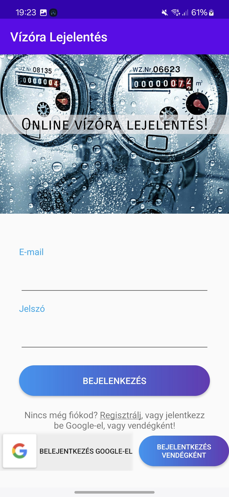

# VízóraProject

Ezt a projektet 2023-ban készítettem, a feladat egy mobilos Android alkalmazás készítése volt Java-ban, a mobilalkalmazás-fejlesztés gyakorlat kurzusra. A téma egy online vízóra lejelentésre szolgáló applikáció készítése volt.

## Funkciók

- **Firebase autentikáció**: Meg van valósítva a bejelentkezés és a regisztráció.
- **Adatmodell definiálása**: Legalább 3 különböző activity használata, class vagy interfész formájában.
- **Beviteli mezők típusa**: A beviteli mezők típusa megfelelő (pl. jelszó kicsillagozva, e-mail esetén megfelelő billentyűzet jelenik meg stb.).
- **Layoutok**: ConstraintLayout és még egy másik layout típus használata.
- **Reszponzív kialakítás**: 
  - Különböző kijelző méreteken is jól jelennek meg a GUI elemek (akár tableten is).
  - Elforgatás esetén is igényes marad a layout.
- **Animációk**: Legalább 2 különböző animáció használata.
- **Navigáció**: Intentek használata, a navigáció meg van valósítva az activityk között (minden activity elérhető).
- **Lifecycle Hook**: Legalább egy Lifecycle Hook használata a teljes projektben (onCreate nem számít), amely értelmes módon beágyazott, nem csak logolás.
- **Android permission**: Legalább egy olyan androidos erőforrás használata, amihez szükséges android permission.
- **Notification kezelés**: Legalább egy notification, alarm manager vagy job scheduler használata.
- **CRUD műveletek**: Minden CRUD művelet megvalósult, és a műveletek service-(ek)be vannak kiszervezve (AsyncTasks).

